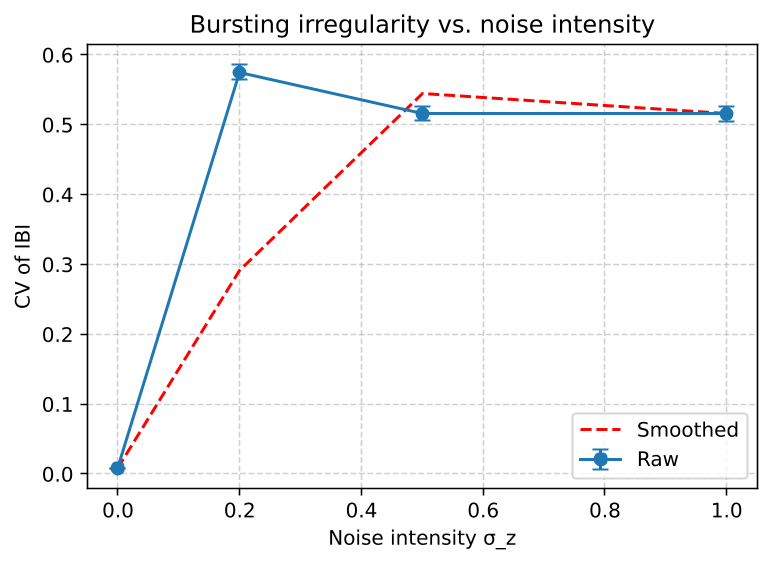

# Stochastic Dynamics & Monte Carlo Engine


## 📌 Overview
This repository implements a high-performance **Stochastic Differential Equation (SDE) solver** and a **Monte Carlo simulation engine**. 

While the system is robust enough to handle generic multi-dimensional SDEs, it is currently demonstrated on a highly non-linear 5D biophysical system (CA1 Pyramidal Cell Model). By introducing **multiplicative noise** (square-root diffusion) into the slow variables, we quantify how stochastic fluctuations degrade the temporal reliability of the system—a framework mathematically analogous to **stochastic volatility modeling** in quantitative finance.

## 🛠️ Core Architecture (Decoupled Design)
Unlike monolithic scripts, this engine separates the numerical solver from the business logic:
*   `core/sde_solvers.py`: The mathematical heart. Implements the **Euler-Maruyama** integration scheme with generalized boundary-clipping protection for robust probability/conductance tracking.
*   `models/ca1_pyramidal.py`: The payload. Contains the complex deterministic drift and stochastic diffusion tensors of the 5D system.
*   `utils/signal_processing.py`: Event-driven analysis tools for peak detection and Inter-Burst Interval (IBI) extraction.
*   `run_parameter_sweep.py`: Exploratory parameter sweep engine. Conducts high-resolution sensitivity analysis to identify dynamic bifurcation points (e.g., the exact threshold for periodic bursting) prior to stochastic testing.
*   `experiments/01_feature_knockout_analysis.py`: Deterministic ablation studies (Factor Knockout Tests) isolating the precise systemic contributions of specific driving forces.
*   `main_monte_carlo.py`: The pipeline. Executes 50 independent Monte Carlo paths with **memory-caching optimization** to reduce redundant computation during statistical aggregation.

## 📊 Quantitative Results

### Phase 1: Deterministic Ablation Studies
Prior to stochastic evaluation, systematic virtual knockouts and parameter tuning were conducted. This confirmed that bursting is an emergent property requiring strict balance between modulatory drivers (e.g., $g_M$, $g_{NaP}$) and core excitability (e.g., $g_{Na}$).

### Phase 2: Stochastic Reliability Degradation
We utilized the Coefficient of Variation (CV) of inter-burst intervals to measure system reliability. Results show a distinct plateau effect in timing degradation as the diffusion coefficient ($\sigma_z$) increases.

<p align="center">
  
  <br>
  <em>Figure: Tail-risk and reliability degradation under varying intrinsic noise intensities.</em>
</p>

## 🚀 Quick Start

```bash
# 1. Clone the repo
git clone [https://github.com/WuYefan77/Stochastic-Dynamics-Engine.git](https://github.com/WuYefan77/Stochastic-Dynamics-Engine.git)

# 2. Install dependencies
pip install -r requirements.txt

# 3. Fire up the Monte Carlo engine
python main_monte_carlo.py
